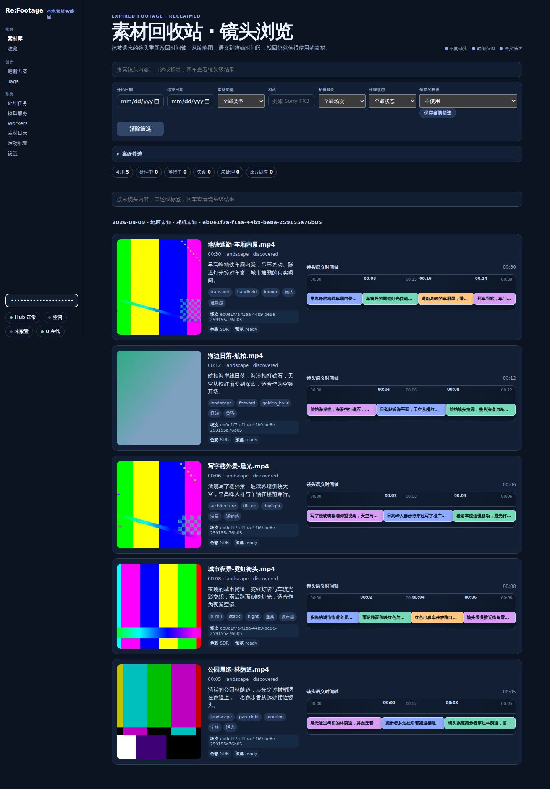
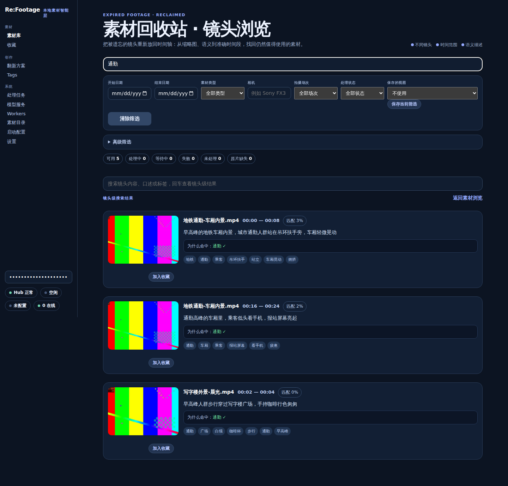
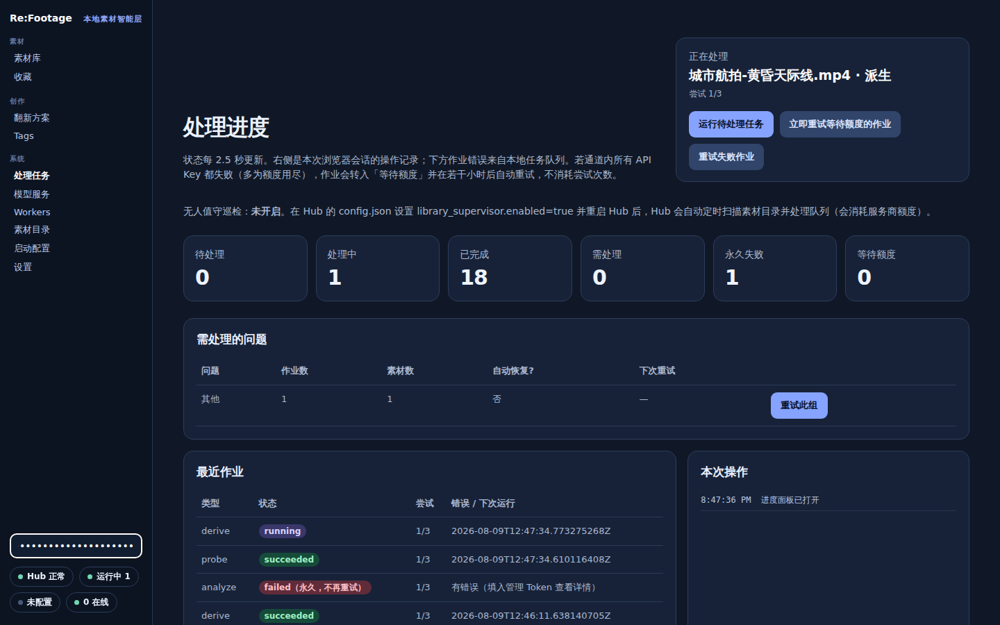

# Re:Footage

> **Expired Footage, Reclaimed.**

A local-first intelligence layer for a video footage library. It reads your
existing folders, works out what is actually inside each clip, and makes that
searchable down to the individual shot.

```text
NAS / Footage
    ↓
Understand
    ↓
Search
    ↓
Exact shot → export / reuse
```

`Re:Footage` is the product name; `timingdex` remains the binary and the
configuration namespace, so existing libraries and Workers keep working.

## 30 seconds: 这是什么? 为什么有用? 长什么样? 怎么跑起来?

**这是什么** — a local-first intelligence layer for your footage library:
indexed, searchable down to the individual shot.

**为什么有用** — 在大量旧素材里找到某样东西真正出现的那几秒.

**长什么样** — three pages cover the whole loop:







**怎么跑起来** — three steps, detailed in [Quick start](#quick-start):

1. `./timingdex doctor` — check ffmpeg, the hardware profile and paths.
2. `./timingdex root add /path/to/footage && ./timingdex root scan <root-id>` — point it at footage, enqueue jobs and synchronously drain the existing Pipeline.
3. `./timingdex serve` — open the browser UI; API scans trigger the existing Pipeline in the background, while `/progress` shows execution status.

### The loop in 30 seconds

装好 → 加素材目录 → 配置模型 → 处理几个片段 → 搜索 → 播放/收藏镜头.
Install, add a footage folder, configure a model, process a few clips, search,
play or favourite the shot.

## Project status

**Alpha / technical preview.** The core ingestion, per-shot analysis, search,
the local multimodal path, and the Hub/Worker architecture are functional and
regression-tested, but APIs, database migrations and model contracts may still
change. There is no stable release yet, no API stability promise, and no
supported-version table.

The current repository release target is `v0.31.0-alpha`. It is being prepared
from `main` and has not been published; see the [v0.31 release
notes](docs/v0.31-release-notes.md) for the release-closure scope and current
verification status.

**Do not expose the Hub directly to the public Internet.** It is built for a
trusted LAN (or a private overlay like Tailscale): library reads are gated by
source network, administrative routes by a token, and the security model
assumes a single trusted machine.

## What it is, and what it is not

It is a **video asset intelligence layer**. It builds an index over footage you
already have: per-shot descriptions, tags, transcripts, capture context, and a
shot-level timeline you can scrub before deciding what to use.

It is **not an AI editor**. It produces a reviewable plan with exact time ranges
for a human editor to act on. It never edits, re-encodes over, or writes anything
next to your source media — originals are opened read-only, and derived files go
in a separate cache.

Two more deliberate non-claims:

- **Proprietary RAW is identified, not decoded.** BRAW/R3D/ARI/CRM/N-RAW are
  recognised and their render state recorded; without a compatible renderer the
  asset is reported as unrendered rather than silently treated as SDR.
- **Shot similarity is a heuristic feature vector**, built from the model's own
  descriptions and tags, blended with SQLite FTS5. Text retrieval may
  additionally use a configured embedding provider (SQLite-stored float32
  vectors, cosine scan in Go — no vector database), but shot similarity itself
  is not a learned visual embedding.

Timingdex is independently usable and is also being developed as part of the
underlying footage intelligence layer for ChatCut.

## How it works

**Timingdex owns the timeline. VLMs describe the frames.**

A scan enqueues jobs; each stage enqueues its successor, so the whole chain is
idempotent and resumable.

```text
Footage / NAS
     ↓
probe + proxy          (ffprobe + read-only derive: thumbnail, 720p proxy)
     ↓
deterministic shot detection
     ↓
2 / 4 / 6 representative frames + timestamped transcript
     ↓
Local VLM / Cloud VLM  (Gemini, Qwen, Volcengine, local OpenAI-compatible)
     ↓
shot-level metadata
     ↓
SQLite FTS5 + hybrid retrieval
     ↓
exact source time range
```

```text
probe → derive → speech_gate → transcribe → [align] → analyze → index
           └────────────── (no audio) ──────────────────┘
```

Everything is local-first: original media stays read-only, derived files live
in a separate cache, all search state is SQLite, and **no vector database is
currently required**. A local VLM is optional — `local_vlm` speaks the same
OpenAI-compatible `chat/completions` surface a llama.cpp / LM Studio / vLLM /
SGLang runtime exposes — and cloud providers plug into the same pipeline.
Whatever answers, a shot's metadata comes only from that shot's own evidence,
and search returns the exact `start_ms` / `end_ms` where the thing you asked
for actually is. Search is a layered retrieval engine (`internal/search`):
query compilation, per-intent retrieval channels, RRF fusion, an evidence gate
that refuses to claim a shot contains something without shot-level evidence
(`confirmed`/`possible`/`contradicted`/`unknown` — unknown is never "确认无
人"), and a diversity selection pass. A configured embedding provider adds a
text-embedding channel (`providers.embedding`); its vectors are a retrieval
signal, never evidence, and `timingdex search rebuild-embeddings` rebuilds
them when the model changes. The structured endpoint
`POST /api/v1/search/shots` serves UI, MCP and editing agents alike with
per-constraint evidence; the legacy GET endpoints keep their exact behaviour.

| Stage | What it does |
| --- | --- |
| `probe` | ffprobe + optional ExifTool; records duration, codecs, capture metadata, colour class |
| `derive` | thumbnail, 720p H.264 proxy, temporary 16 kHz audio |
| `speech_gate` | decides locally whether transcription is worth paying for |
| `transcribe` | the configured ASR provider, with fallback |
| `align` | optional forced alignment through an external command |
| `analyze` | the configured video-understanding provider → shots, tags, summary |
| `index` | SQLite FTS5 rebuild |

### Model output never writes directly to canonical tables

This is the boundary the project is built around.

```text
input hash → model_runs (immutable cache + staging)
          → parse + schema/vocabulary validation
          → transactional commit to asset_analysis
          → FTS5 rebuild
```

Failed, timed-out, malformed or out-of-range responses stay in `model_runs` and
cannot contaminate trusted analysis, tags, shots or search rows. The same shape
governs tag governance (`raw tags → normalize → unresolved pool → staged
proposals → human approval → canonical catalog`) and Repurpose plans (immutable
revisions; approval is human-only and locks the plan). **Agents may draft; humans
approve.**

## Requirements

- Go 1.25.5 (match `go.mod` — the module is the dependency truth)
- `ffmpeg` / `ffprobe`. Any recent build runs the pipeline. The read-rate limit
  additionally needs **FFmpeg 5.1+**, since `-readrate` does not exist before
  that; on an older build that one setting is skipped with a warning instead of
  failing every derive.
- `exiftool` — recommended, optional. Without it, capture metadata is limited to
  what ffprobe exposes.

No database server, no web framework, no frontend build step. Timingdex
intentionally keeps its dependency surface small and avoids a web framework,
ORM and frontend build system; `go.mod` lists every direct dependency.

## Build

```bash
go mod tidy
go test ./...
go build -o timingdex ./cmd/timingdex
```

Or build nothing locally: `Dockerfile` is multi-stage and compiles inside the
Go image, so Docker alone is enough — no Go toolchain, and FFmpeg and exiftool
come with the runtime image. That is the shortest path on Windows.

```bash
TIMINGDEX_MEDIA_ROOT=/path/to/footage docker compose up -d --build hub
```

On PowerShell, or to keep provider keys out of your shell history, put the
variables in an untracked `.env` beside the Compose file instead; Compose reads
it automatically.

The Hub then answers on `https://127.0.0.1:8787`, and `root add` must be given
the container path (`/media/library`), not the host path. A published port puts
Docker's NAT in front of the read guard described under
[security boundaries](#security-boundaries), so read
[the deployment notes](docs/v0.14-deployment.md#docker-compose) before widening
that binding.

The plain image above has no GPU userspace installed, so hardware
acceleration inside it falls back to software x264 regardless of the host.
`docker build --target gpu` produces a second image with the Intel/AMD VAAPI
userspace layered on top (NVIDIA needs nothing baked in — it comes entirely
from the host via the NVIDIA Container Toolkit); pair it with the
commented-out device-passthrough stanzas in `docker-compose.yml` to actually
hand the container `/dev/dri` or an NVIDIA device. See
[GPU Docker images and Unraid deployment](docs/v0.19-gpu-docker-unraid.md)
for the image tags, the Compose wiring, the Unraid Community Applications
templates under `deploy/unraid/`, and the `NVIDIA_DRIVER_CAPABILITIES`
gotcha that makes NVENC fail silently without it.

## Quick start

```bash
export TIMINGDEX_DATA_DIR="$PWD/.timingdex-dev"

./timingdex doctor                        # check ffmpeg, hardware profile, paths
./timingdex root add /path/to/footage     # read-only; nothing is written there
./timingdex root scan <root-id>           # scans, enqueues, and drains the Pipeline
./timingdex search rebuild                # rebuild asset-level FTS from canonical rows
./timingdex search rebuild-embeddings     # re-embed all shots (after a model switch)
./timingdex cache inspect                 # report cache categories and rebuildable space
./timingdex cache verify                  # compare derived-artifact rows with cache files
./timingdex cache gc --rebuildable --yes  # delete rebuildable artifacts and enqueue re-derive
./timingdex serve                         # HTTPS by default; prints the Worker fingerprint
```

Then open the browser UI. Analysis commits shot-level
FTS immediately; the successor `JobIndex` rebuilds the asset-level FTS row.

Everything lives under `$TIMINGDEX_DATA_DIR`: `timingdex.db`, optional
`config.json`, `cache/`, `admin-token`, `agent-token`, `provider-secrets/`.
Deleting that directory is how you reset.

On first start the Hub generates and persists the raw `admin-token` (exact mode
`0600`) so the same bearer credential can be recovered after a Hub restart. The
data directory is exact mode `0700`; the token must be a regular, non-symlink
file with exact mode `0600`. The Hub fails closed rather than repairing an unsafe
directory or token file. Use the token only for Hub management calls; never put
it in Worker configuration or browser storage.

If jobs failed because a provider was not configured yet, configure it and then:

```bash
./timingdex pipeline retry-failed
```

### Maintenance commands

`timingdex search rebuild` repairs all asset-level FTS rows from canonical data.
It is separate from `search rebuild-embeddings`, which rebuilds the shot text
embedding rows after an embedding-model change and never reruns VLM analysis.

Cache maintenance is intentionally explicit:

- `timingdex cache inspect` reports artifact classes, orphan directories and
  rebuildable space.
- `timingdex cache verify` reports missing derived files and cache files without
  database rows. Source staging under `cache/sources/` is excluded by design.
- `timingdex cache gc [--scratch] [--rebuildable] [--orphans] [--yes]` removes
  only the named disposable categories. Without `--yes` it is a dry run; with
  `--rebuildable --yes`, completed assets are queued for re-derive.
- `timingdex cache repair-derived --invalidate-hardware-profiles [--yes]`
  removes hardware-derived thumbnail/proxy rows and files and, with `--yes`,
  queues re-derive jobs. Without `--yes` it only reports what would change.
- `timingdex secrets rekey` rotates the encrypted provider-secret store's data
  key, re-encrypts all secrets and keeps the previous key at
  `provider-secrets/store.key.pre-rekey`. The operation is journaled and
  recovers interrupted file replacement on the next open.

Neither an exhausted attempt budget nor a permanent failure is undone by
re-scanning, so this is the way back.

## The browser UI

Served by `timingdex serve` over HTTPS by default. The browser uses a short-lived,
memory-only Hub administrator Session in an HttpOnly cookie plus a readable CSRF
cookie; the pasted administrator token is used only to establish that Session and
is never stored in browser storage. CLI, Agent, and Worker clients keep their
separate Bearer credentials.

| Page | Purpose |
| --- | --- |
| `/` | The library. Each row is **thumbnail → material context → shot-level timeline**, so you can see what exists at each point in a source before planning anything. Filter by capture date, region, camera or shoot session, or by asset type, shot size, camera motion, audio type, quality, usable-as and a duration range. |
| `/progress` | Run the queue; watch counts, per-job attempts and failures. Failure text is administrator-only. |
| `/settings` | Disk-load limits (below). |
| `/repurpose` | Turn an editorial brief into a reviewable plan; choose, lock or exclude candidates per section, then approve a revision. |
| `/tags` | Tag governance: review and approve staged proposals. |
| `/providers` | Capability-scoped model channels; add, test, enable, disable, remove. Keys never come back to the browser. |
| `/workers` | Paired node status, stage/progress, retry history, optional derive routing. |
| `/worker-setup` | Generates an install script for a new Worker. |
| `/setup` | Startup configuration help. |

The settings page also exposes optional daily and monthly cost guides. They are
operator references for the append-only post-call estimate ledger, never billing
records or enforced provider caps. Exceeding a guide does not pause, reject or
defer analysis or transcription; the cost summary reports `today_estimate` and
`month_estimate` in the configured channel unit.

## Limiting disk load

By default the pipeline reads source media as fast as the bus allows, and a
full-library scan holds a mechanical disk or a NAS link at that rate for hours.
`/settings` bounds it. Both levers default to off, so upgrading never silently
slows an existing library.

The pipeline leases **one job at a time**, so this is not a concurrency setting.
The two things that actually reduce sustained load are:

- **Read-rate limit** — caps FFmpeg's input read speed as a multiple of realtime
  (`1` reads a 10-minute clip over 10 minutes). Only whole-file reads honour it;
  a thumbnail decodes a single frame, where a cap would just slow the seek.
- **Per-job cooldown** — the pause after each finished job. This is what turns a
  multi-hour scan from continuous load into duty-cycled load. A rate cap alone
  still reads flat out, only slower.

An **off-peak window** defers heavy work to the small hours. Assets above a size
threshold wait for the window; assets below a second, smaller threshold are exempt
from both the wait and the rate cap — throttling a phone clip saves nothing and
only makes the library feel broken. Size rather than duration, because bytes read
is what the disk feels.

The window is judged in the **Hub's** local time, and the page shows the Hub's own
clock so a time set from another zone is not ambiguous. Inside the window the
cooldown is skipped: draining the queue at full speed at night is the point of
having a window.

Changes take effect on the next job, not on restart, so a scan that is already
grinding can be reined in. Held work is filtered before it is leased, so waiting
for a window never consumes a job's retry budget.

## Configuration

Copy `config.example.json` to `$TIMINGDEX_DATA_DIR/config.json`. Most settings
also have an environment variable; provider keys are read from the environment or
from the encrypted store, never from the config file in plaintext.

### Hardware-accelerated derived media

Acceleration applies to the read-only derive stage only: hardware decode for
thumbnails and proxies, hardware H.264 for the 720p proxy. The original file is
never modified.

```json
{ "hardware": { "mode": "auto", "allow_fallback": true, "proxy_bitrate_kbps": 1800 } }
```

| `mode` | Selects |
| --- | --- |
| `auto` | macOS VideoToolbox; on Linux CUDA/NVENC, then Intel QSV, then VAAPI |
| `cuda` | NVIDIA discrete GPU decode + NVENC |
| `qsv` | Intel Quick Sync Video |
| `vaapi` | Linux DRM render device, normally `/dev/dri/renderD128` |
| `videotoolbox` | Apple silicon / Intel Mac media engine |
| `software` | force libx264 |

The detector inspects the installed FFmpeg build rather than guessing from the
machine — `timingdex doctor` or `GET /api/v1/hardware` reports what was chosen.
With `allow_fallback`, an unsupported codec or driver retries in software.
Hardware and software cache paths are kept distinct, so a software proxy is never
mislabelled as a hardware result.

### NAS and network shares

Timingdex runs on a machine with CPU/GPU, not on the NAS. Mount the share, add the
mounted folder as a normal library root, and enable copy staging:

```json
{ "source_staging": { "mode": "copy" } }
```

The source is opened read-only and copied once into
`$TIMINGDEX_DATA_DIR/cache/sources/` before any FFmpeg, ASR or analysis work. The
NAS receives no derived files, sidecars or metadata writes, and a completed cache
entry keeps working if the share disconnects. Budget local disk for the files being
processed; the cache is disposable while Timingdex is stopped.

The `/library-roots` wizard turns a pasted `smb://`/`nfs://`/UNC address into
paste-ready mount commands rather than guessing a password or mounting
anything itself — `internal/mount` deliberately never acquires root for you.
For the containerised Hub, mounting the share is a host-side step, not a
container one; [NAS mounting](docs/v0.20-nas-mounting.md) is the decision
record for why: it ranks every option from "mount on the host, bind a parent
directory into the container" down to the ones that were evaluated and
rejected (mounting inside the container, a userspace SMB client), and states
the real cost of the Docker-native NFS and SMB volume paths — NFS carries no
password at all, SMB's does end up in cleartext in Docker's own volume
metadata.

### Video understanding providers

```text
video → VideoUnderstandingProvider router → VideoAnalysisResult
        ├── Gemini            ├── summary / scenes / shots
        ├── Qwen              ├── objects / actions / mood
        ├── Volcengine        └── raw_tags + confidence
        └── local VLM
```

Set `providers.vision_primary` to `gemini`, `qwen_video`, `volcengine_video` or
`local_vlm`, and list alternatives in `providers.vision_fallback`. Set it to
`none` to browse an existing library without analysing: jobs then fail visibly
rather than being filled with a fabricated local result.

Prefer `/providers` over the config file for **cloud** channels. A channel is
capability-scoped, can hold several keys for the same provider, and gets
health-aware retry, cooldown, concurrency limits and ordered fallback. Keys
are encrypted in the Hub-only `provider-secrets/` directory (`0700`, files
`0600`) and are never returned by any API, written to SQLite, or sent to a
Worker's configuration.

One deliberate exception: **Local Multiframe v1 currently uses
`providers.local_vlm` in `config.json`.** The `/providers` channel UI does not
yet route `openai_multiframe` through the multiframe orchestration path; a
channel with that protocol is refused with a clear message at build time
rather than failing mid-analysis. See below.

### Local multimodal analysis (Local Multiframe)

Timingdex detects shot boundaries itself (ffmpeg scene filter or an external
detector), samples 2/4/6 representative frames per shot, slices the timed
transcript per shot, and sends *still frames* to a local OpenAI-compatible
VLM — the endpoint never receives whole videos. This is the cheapest way to
index a library on one machine with an 8–16 GB consumer GPU.

Timingdex does **not** download models or start the VLM runtime. Point it at
an OpenAI-compatible multimodal HTTP endpoint:

```json
{
  "providers": {
    "vision_primary": "local_vlm",
    "local_vlm": {
      "enabled": true,
      "protocol": "openai_multiframe",
      "base_url": "http://127.0.0.1:8080/v1",
      "path": "chat/completions",
      "model": "Qwen3-VL-4B-Instruct"
    },
    "shot_detection": {
      "enabled": true,
      "mode": "ffmpeg_scene",
      "scene_threshold": 0.3
    }
  }
}
```

```bash
export TIMINGDEX_DATA_DIR="$PWD/.timingdex-dev"
./timingdex root add /path/to/footage
./timingdex root scan <root-id>
./timingdex pipeline run      # leases and runs jobs until the queue is idle
./timingdex search rebuild-embeddings   # after switching the embedding model
./timingdex serve
```

Any OpenAI-compatible multimodal runtime (llama.cpp, LM Studio, vLLM, SGLang,
Ollama) satisfies the contract; the model only has to describe still frames
and return the shot-metadata schema. See
[docs/v0.25.1-multiframe-local-vlm.md](docs/v0.25.1-multiframe-local-vlm.md)
for the sampling rules and honest boundaries of the v1 path.

### Relay and reverse-proxy endpoints

Direct provider endpoints and relays use the same configuration shape:

| Field | Meaning |
| --- | --- |
| `base_url` | official or relay base URL |
| `path` | endpoint path the relay exposes |
| `protocol` | e.g. `gemini_interactions`, `openai_chat`, `openai_video`, `openai_embeddings` |
| `auth_header` | usually `Authorization`, or e.g. `x-goog-api-key` |
| `auth_scheme` | `Bearer`, another scheme, or `raw` to send the key bare |
| `extra_headers` | anything else the relay needs |
| `model` | relay-side alias; need not match the official model name |

```json
{
  "enabled": true,
  "protocol": "openai_chat",
  "base_url": "https://relay.example.com/v1",
  "path": "chat/completions",
  "api_key_env": "TIMINGDEX_RELAY_KEY",
  "model": "gemini-3.6-flash"
}
```

The OpenAI-compatible video adapter sends a `video_url` data URL, so the relay
must genuinely support video content — a text/image-only gateway is not enough.

### Volcengine Agent Plan / Coding Plan

The two personal plans are treated as **separate quota and key domains**, not as
aliases of one relay, so Agent Plan traffic cannot draw down Coding Plan quota.

| Plan | Roles | Base URL |
| --- | --- | --- |
| Agent Plan | Tag Curator / library summary, tag embeddings, Seed ASR 2.0 | `https://ark.cn-beijing.volces.com/api/plan/v3` |
| Coding Plan | Tag Curator / library summary, plan embedding entitlement | `https://ark.cn-beijing.volces.com/api/coding/v3` |

```json
{
  "providers": {
    "asr_primary": "volcengine_asr",
    "asr_fallback": "qwen",
    "tag_curator_primary": "volc_agent_plan",
    "embedding_primary": "volc_agent_plan_embedding",
    "volc_agent_plan": { "enabled": true },
    "volc_agent_plan_embedding": { "enabled": true },
    "volc_asr": { "enabled": true }
  }
}
```

Set `model` to something enabled for your subscription in the Volcengine console;
the example names are not a fixed allow-list.

Both plan endpoints authenticate with `Authorization: Bearer <key>`, which is what
these blocks now default to. Releases before this one shipped `"auth_header":
"X-Api-Key"` / `"auth_scheme": "raw"`, and an Agent Plan account rejects that with
a 401 — indistinguishable from a bad key. If your `config.json` was copied from an
earlier `config.example.json`, delete those two fields from the four
`volc_*_plan*` blocks (or set them to `Authorization` / `Bearer`); an existing
config file overrides the corrected defaults. Note that `volc_asr` is unaffected:
Seed ASR 2.0 is a different service on a different host and genuinely uses
`X-Api-Key`.

Seed ASR 2.0 is not OpenAI-shaped: it uses the documented native WebSocket binary
protocol, so it exists only as `volcengine_asr` and is never sent to an audio
endpoint. It defaults to offline `bigmodel_nostream`, which suits imported
footage: derived audio is converted to 16 kHz mono PCM and sent in 200 ms chunks.
A missing subscription capability or wrong resource ID fails the run and activates
the configured fallback — it cannot silently downgrade to an older ASR model.

### ASR flow

1. Speech Gate decides whether transcription is needed at all.
2. `asr_primary` is called.
3. On provider failure, `asr_fallback` is attempted.
4. Successful transcripts are cached by `asset_id + input_hash`.
5. Vision analysis consumes the transcript when available.

### Tag governance

```text
raw tags → normalize → exact canonical/alias resolution → unresolved pool
        → bounded Tag Curator → staged proposals → human approve/reject
        → transactional catalog update → affected asset links updated
```

The heuristic curator is deliberately conservative. An optional OpenAI-compatible
or Gemini-native small model implements the same proposal contract — it can return
semantic groups only. Timingdex derives the database IDs itself, rejects aliases
absent from the unresolved pool, and writes nothing to the canonical catalog until
a human approves.

Optional embedding-based clustering finds candidate groups before the Curator
names them. It embeds normalised tag **strings** only; it never sees video and
does not rank footage. Without an embedding provider, clustering is simply
unavailable — a lexical fallback is not presented as semantic clustering.
(The search engine's `text_embedding` channel is a separate use of the same
provider interface: it embeds shot text — description/tags/speech — and only
ever ranks, never proves; evidence comes from the gate, not the vectors.)

```bash
curl -X POST 'http://127.0.0.1:8787/api/v1/tags/clusters?limit=500&threshold=0.86'
```

`threshold` is cosine similarity and is conservative by default. Nothing merges
automatically.

### Optional forced alignment

With `providers.alignment.enabled`, Timingdex runs the configured command and
writes one JSON object to stdin:

```json
{"audio_path":"/abs/audio.m4a","language":"zh","text":"完整转写文本","segments":[]}
```

The adapter writes JSON to stdout:

```json
{"words":[{"start_ms":1320,"end_ms":1680,"text":"我们","confidence":0.98}]}
```

This keeps Python, CUDA and forced-aligner dependencies outside the Go process; a
Qwen3-ForcedAligner wrapper can satisfy the contract with no changes here.

## Search

```bash
curl --get --data-urlencode 'q=demo' http://127.0.0.1:8787/api/v1/search
curl --get --data-urlencode 'q=雨夜街道' http://127.0.0.1:8787/api/v1/search/shots
curl --get --data-urlencode 'q=rainy city night' http://127.0.0.1:8787/api/v1/search/shots/hybrid
curl http://127.0.0.1:8787/api/v1/shots/<shot-id>/similar
curl http://127.0.0.1:8787/api/v1/discover/rare-shots
```

Results carry the source asset plus exact `start_ms` / `end_ms`, so a plan can
reference a clip without touching the media. Chinese queries fall back to a
parameterised literal match, so short terms like `雨夜` work against the existing
index. `rare-shots` is **library-relative**: it finds uncommon semantic
combinations in *your* library, not universally good shots.

## Repurpose plans

```text
brief → optional planner (or deterministic fallback) → material needs
     → shot search and ranking → reviewable plan with exact time ranges
```

```bash
curl -X POST http://127.0.0.1:8787/api/v1/repurpose/plans \
  -H 'content-type: application/json' \
  -d '{"brief":"我要做一个深圳城市宣传视频","duration_ms":30000,"style":"城市生活","audience":"品牌客户"}'
```

Creating a plan creates revision 1. An editor picks one candidate per section,
optionally locks it, excludes weak alternatives, adds a note, and saves a new
immutable revision. Only the latest draft can be approved, and approval locks the
plan.

The planner may propose semantic queries and section durations. It **cannot**
invent asset IDs, shot IDs or timestamps. A locked selection changes only after an
explicit unlock in a later revision. Approval rejects a required section that has
candidates but no explicit choice, so a gap stays visible instead of being
approved by accident. When the only valid match for a required section is a shot
already used elsewhere, it is kept and marked `reused: true` — a visible editorial
trade-off rather than a silently missing ending.

An approved plan exports as a CMX3600 EDL or an FCPXML 1.9 document:

```bash
curl -H "Authorization: Bearer $(cat "$TIMINGDEX_DATA_DIR/admin-token")" \
  http://127.0.0.1:8787/api/v1/repurpose/plans/<plan-id>/export.edl
```

Both routes are administrator-only and reject the agent token. An FCPXML embeds
the absolute path of every original — the one thing `access_original_media_paths`
denies — and an EDL is the artifact an editor cuts with, so both sit on the human
side of the approval boundary. Order and selection are exactly what was approved;
nothing is re-ranked at export time.

## Distributed: Hub and Workers

One binary, two roles. The **Hub** owns the database, the browser UI, source
probing and all secrets. A **Worker** owns only its local cache, FFmpeg work and a
revocable node token. Original media stays read-only and `probe` reads it directly
on the NAS.

Workers stage media into their own cache, upload thumbnail/proxy/audio artifacts
back to Hub storage, then report completion — so previews stay available while a
Worker is offline.

### Enrolling a Worker

Easiest path: open `/worker-setup`, which generates a ready-to-run install script
(PowerShell for Windows, POSIX `sh` for Linux) with the hub URL, certificate
fingerprint, one-time pairing token and mounts already filled in. Cross-compile
the Worker and drop it into `$TIMINGDEX_DATA_DIR/worker-binaries/` — the Hub
serves it, so the LAN needs no second web server:

```bash
GOOS=windows GOARCH=amd64 go build -o timingdex-windows-amd64.exe ./cmd/timingdex
GOOS=linux   GOARCH=amd64 go build -o timingdex-linux-amd64      ./cmd/timingdex
GOOS=linux   GOARCH=arm64 go build -o timingdex-linux-arm64      ./cmd/timingdex
```

That endpoint is administrator-gated because the generated script embeds a
single-use pairing token. Treat the script as a credential; do not commit it.

By hand:

```bash
timingdex worker enroll --hub https://nas:8787 --fingerprint <fingerprint> \
  --pairing <one-time-token> --name studio-windows \
  --mount <library-root-id>=D:\\NAS\\Footage
timingdex worker run
```

`provider_operations` is enrollment-time trust; heartbeats cannot grant provider
access. Re-enroll to change it.

### Windows: tray icon

```bash
timingdex worker run --tray
```

Puts an icon in the notification area with **设置…** and **退出**. Quitting from
the menu stops the lease loop rather than killing the process, so a job in flight
is reported back instead of leaving a stale lease on the Hub.

It is built on Win32 through the standard library, so a Worker stays one
cross-compiled `.exe` with no DLLs beside it. Note that a tray program and a
Windows **service** are different things: a service runs in session 0 and has no
notification area. For autostart, put a shortcut in the Startup folder.

**设置…** opens a settings page the Worker serves on `127.0.0.1`, covering exactly
the three values the Hub cannot push down — hub URL, pinned fingerprint, node
token — because a Worker must know where to look before it can be told anything.
Mounts, limits and capabilities stay Hub-decided. The listener is loopback-only
and every route is gated by a random token in the URL, since a loopback port is
reachable by any process on the machine. The node token can be replaced but is
never displayed; leaving it blank keeps the current one, so the hub address can be
changed without re-pasting a credential you cannot read.

### Under WSL

This works. WSL is **Linux**, so use `timingdex-linux-amd64`, not the `.exe`, and
expect `--tray` to refuse — there is no notification area for a Linux binary, and
it says so rather than starting a process you cannot quit. Stop it with `Ctrl-C`
or run it under `systemd` inside the distro.

Reading footage through `/mnt/c` crosses WSL's 9p filesystem bridge, which costs
roughly 4–8× against a native read. Measured on one WSL2 box with `O_DIRECT`, so
the page cache is out of the way:

| | native ext4 | `/mnt/c` (9p) |
| --- | --- | --- |
| sequential read, 1 MiB blocks | 3.6 GB/s | 422 MB/s |
| sequential read, 64 KiB blocks | 1.1 GB/s | 268 MB/s |
| random 64 KiB read | 1.04 ms | 2.51 ms |

Read the absolute column, not the ratio: 268–422 MB/s still exceeds any
mechanical disk and saturates a 1 GbE NAS link several times over, so for footage
on spinning disks or a NAS the bridge is not the bottleneck — the source is. It
only becomes the limit when the media sits on fast local NVMe, where the native
Windows binary skips the bridge and is the better choice.

If the media is on a NAS, mount the share *inside* WSL rather than through a
Windows drive letter — one bridge crossing fewer, and the mount options become
yours:

```bash
sudo mount -t cifs //nas/footage /mnt/footage -o ro,username=<user>,vers=3.0
timingdex worker enroll --hub https://nas:8787 --fingerprint <fingerprint> \
  --pairing <one-time-token> --name wsl-worker \
  --mount <library-root-id>=/mnt/footage
```

Mount read-only: Timingdex never writes beside source media, and `ro` makes that a
property of the mount rather than a promise.

One WSL-specific detection gap to know about: `/dev/dri` does not exist under
WSL2, so Intel QSV and VAAPI are genuinely unavailable there and `doctor`
correctly reports software. An NVIDIA GPU does work, but only if FFmpeg was built
with NVENC — a Homebrew FFmpeg typically is not, and then `-hwaccels` lists
nothing at all. Check before assuming the GPU is being used:

```bash
ffmpeg -hide_banner -encoders | grep nvenc
```

### Provider calls from a Worker

Both modes below read **`providers.*` config only** (`config.json`/env) — never a
`/providers` channel, even an enabled one with a healthy member. This is
deliberate, not an oversight: a channel carries channel-scoped keys, member
pools and health state that are meant to stay Hub-side, and a Worker's
provider access already has its own, narrower trust boundary (opt-in
direct-credential delivery, or the Hub-side JSON proxy). If you followed the
advice above to prefer `/providers` over the config file, a Worker asking for
that same capability still fails, but the two ways it can fail now answer
differently: 403 (`app.ErrWorkerProviderConfiguredAsChannelOnly`) if the
capability is configured only as a channel, which this path does not read;
503 (`app.ErrWorkerProviderNotConfigured`) if nothing is configured for it by
either method. Both routes answered a flat 400 for either case before, which
read like your `/providers` setup was wrong when it was not. Give the Worker
its own `providers.*` entry for any operation it needs to reach directly or
through the proxy.

**Proxy mode** (default) relays small JSON provider requests through the Hub and
keeps the key Hub-side. It rejects video, audio, images, multipart uploads and
bodies over 2 MiB, so it cannot become a media relay.

**Direct mode** is an explicit opt-in for a trusted Worker that already sees the
media mount. Enable `hub_security.allow_worker_provider_credentials` only after
reviewing that device boundary. The Worker may request a task-bound provider
configuration only while it holds that job lease and only for a declared
operation. The key is never written to Worker config, SQLite or logs — but a
long-lived third-party key does become visible in that Worker's memory. The
five-minute lease is a delivery and audit window, **not** upstream key revocation.

See [NAS Hub and Worker deployment](docs/v0.14-deployment.md) for Docker, systemd
and ARM notes, and [v0.16 operations](docs/v0.16-operations.md) for mode selection
and an acceptance checklist.

## Security boundaries

These are load-bearing, not aspirational.

- **Original media is read-only.** Nothing is ever written beside a source file.
- **Provider keys** live only in the encrypted, Hub-only `provider-secrets/`
  store. Never in SQLite, API responses, browser storage, Worker config, logs or
  error strings.
- **Administrator token** (`admin-token`, exact `0600`) is a raw bearer credential
  reused across restarts and compared in constant time. Whether it is demanded is
  controlled by `hub_security.admin_auth`: `required` always demands it;
  `trusted_network` (the default) waives it for peers inside
  `hub_security.admin_auth_networks`, so LAN peers skip the password while
  internet peers still need it; `off` never demands it. New write endpoints
  default to gated. The waiver is decided from the peer address alone, exactly
  like the read guard below — so behind a reverse proxy or a published Docker
  port, where every peer looks like the RFC1918 bridge gateway, you MUST set
  `admin_auth_networks` explicitly (or use `admin_auth: "required"`), or the
  admin password is waived for anyone who can reach the port.
- **Agent token** (`agent-token`, exact `0600`) follows the same raw-token file
  contract and restart reuse. It is a strictly narrower credential: it is
  accepted on exactly two routes — create and revise a *draft* Repurpose plan —
  and refused everywhere else. Plan approval and pipeline runs stay
  administrator-only, so `approval_mode: human_required` is enforced by access
  control rather than by prompt text.
- **Library reads** (browse, search, thumbnails, proxies) carry no token so the UI
  works without one, and are restricted instead by **source network**: loopback,
  the RFC1918 ranges, link-local, IPv6 unique-local, and the CGNAT range that
  Tailscale-style overlays assign — so a Tailnet reaches the Hub while a forwarded
  port does not. Override with `hub_security.trusted_read_networks`, where an
  explicit list *replaces* the defaults and a malformed range fails startup. A
  valid token is admitted from any network. Forwarded headers are deliberately
  ignored, because they are attacker-controlled on a directly exposed listener —
  so a reverse-proxied deployment must do this filtering itself.
- **Worker trust** is a one-time pairing token, a revocable node token, and TLS
  certificate fingerprint pinning.
- **Capture coordinates** are exposed as a region label. Source precision is
  administrator-only, per asset.

## Agent Skill

A versioned Skill lives at `skills/timingdex`. It can inspect readiness, retrieve
shot evidence, create a draft plan and submit a user-directed revision. Point a
Skill session at that folder and the local server URL, and give it the **agent**
token — not the administrator token.

Before acting it calls `GET /api/v1/agent/capabilities`, which declares that plan
approval, pipeline execution, provider keys and original-media paths are out of
bounds. That is now enforced by the routes themselves: approval remains a human
action in the Repurpose workspace.

## API examples

```bash
curl http://127.0.0.1:8787/api/v1/health
curl http://127.0.0.1:8787/api/v1/assets
curl http://127.0.0.1:8787/api/v1/jobs
curl http://127.0.0.1:8787/api/v1/hardware
curl http://127.0.0.1:8787/api/v1/pipeline/throttle
curl http://127.0.0.1:8787/api/v1/assets/<asset-id>/shots
curl -H "Authorization: Bearer $(cat "$TIMINGDEX_DATA_DIR/admin-token")" \
  -X POST http://127.0.0.1:8787/api/v1/pipeline/run
```

Read routes need no token from a trusted network. Writes need the administrator
token unless `hub_security.admin_auth` waives it (`trusted_network` for trusted
peers, or `off` for everyone).

## Testing

```bash
go test ./...          # all offline: provider adapters use httptest fixtures
go vet ./...
GOOS=windows GOARCH=amd64 go vet ./...   # the tray is Win32 code CI cannot run
```

`internal/media/process_integration_test.go` skips itself unless `ffmpeg` and
`ffprobe` are on PATH. **No test ever calls a real provider API.**

### Offline eval corpus（评估语料）

`timingdex-corpusgen` generates the offline eval corpus: deterministic
synthetic clips (lavfi test sources, reproducible and licence-free) plus
`ground_truth.json`, mirroring the retrieval golden set's adversarial assets
in `internal/repository/sqlite/retrieval_golden_corpus_test.go`. `timingdex-eval`
then runs a provider configuration against that corpus exactly the way a Hub
would and scores the results with the product's hybrid retrieval; `score`
attributes false positives per signal (`semantic_false_positives` /
`lexical_false_positives`, the same attribution the golden set uses). Each
run's data dir holds its own `config.json` (the same file a real Hub uses) and
database, so comparing models is comparing data dirs. Not part of CI — it is
the manual, offline benchmark.

```bash
timingdex-corpusgen --out ./corpus
timingdex-eval run  --corpus ./corpus --data-dir ./eval/qwen   --label qwen3vl-4b
timingdex-eval run  --corpus ./corpus --data-dir ./eval/gemini --label gemini-flash
timingdex-eval score --corpus ./corpus --data-dir ./eval --labels qwen3vl-4b,gemini-flash
```

## Documentation

`CHANGELOG.md` records what changed and, more usefully, which boundary each change
moved. Each release also has a version-scoped document under `docs/`:

- [v0.30 — review-fix round goal and operations](docs/v0.30-review-fix-round.md)
- [v0.31 — deployment guide](docs/v0.31-deployment.md)
- [v0.31 — footage capability provider](docs/v0.31-footage-capability-provider.md)
- [v0.31 — release-closure notes and verification status](docs/v0.31-release-notes.md)
- [v0.21 — unattended inspection, quota-exhausted waiting, and timeline export](docs/v0.21-unattended-and-export.md)
- [v0.21 — model provider deployment](docs/v0.21-provider-deployment.md)
- [v0.21 — retrieval and search](docs/v0.21-retrieval-and-search.md)
- [v0.20 — NAS mounting: the ladder and why each rung sits where it does](docs/v0.20-nas-mounting.md)
- [v0.19 — GPU Docker images and Unraid deployment](docs/v0.19-gpu-docker-unraid.md)
- [v0.18 — disk load limits, off-peak scheduling, Worker onboarding](docs/v0.18-throttle-and-worker-onboarding-goal.md)
- [v0.17 — regression repair and retrieval performance](docs/v0.17-regression-and-retrieval-goal.md)
- [v0.16 — operations and security](docs/v0.16-operations.md)
- [v0.15 — operations guide](docs/v0.15-operations.md)
- [v0.14 — NAS Hub and Worker deployment](docs/v0.14-deployment.md)

## Contributing

See [CONTRIBUTING.md](CONTRIBUTING.md) for the dependency rule, the local test
gate and the boundaries a change must not cross. Report vulnerabilities
privately — [SECURITY.md](SECURITY.md).

## Screenshots

Real captures from a running Hub are in the [30 seconds](#30-seconds-这是什么-为什么有用-长什么样-怎么跑起来)
section at the top: the library with the shot semantic timeline, shot-first
search results, and the processing/providers view. They are captures of a live
instance — never mockups.

## License

Licensed under the [Apache License, Version 2.0](LICENSE). Third-party
licences for the components linked into the binary are listed in
[THIRD-PARTY-LICENSES](THIRD-PARTY-LICENSES).

```text
Copyright 2026 ev
```

Apache-2.0 was chosen over MIT for its explicit patent grant, which matters for a
tool that may be used commercially. The direct dependencies keep their own
licences — see `THIRD-PARTY-LICENSES` for the full list (`modernc.org/sqlite`
BSD-3-Clause, `github.com/coder/websocket` ISC, `github.com/mark3labs/mcp-go`
MIT, `golang.org/x/crypto` / `golang.org/x/net` BSD-3-Clause, and their
transitive modules). `ffmpeg`, `ffprobe` and `exiftool` are external programs
Timingdex invokes, not bundled code — their licences are their own.
